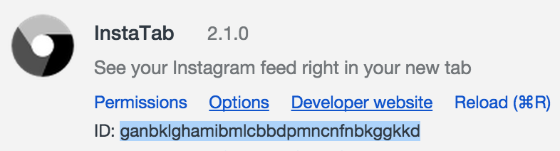

**No longer maintained**

InstaTab
=====

Download: [Chrome Web Store](https://chrome.google.com/webstore/detail/instatab/fedaamalccmbkgonnoihlnpcplcomlll?hl=en)

Dev setup
=========

Follow the steps below to get your dev environment setup.

1. Clone this repo
2. Copy the `config.example.json` file to create a `config.json` file.
3. Get an Instagram app that will allow you to get your `client_id` and `redirect_id`. See Step 6 for `redirect_uri`.
4. Open [chrome://extensions](chrome://extensions) and enable "Developer Mode", then click "Load Unpackaged Extension".
5. Once the app is loaded, you'll see an ID under the extension's links. See screenshot. 
6. Now, back in your Instagram dev console, your app's redirect URI will be "chrome://" plus the extension id.
7. The extension is now ready for development. In your command line, run `grunt watch` to continuously watch all the files in the extension directory.

Notes: using `grunt watch` will build so that your extension can be ready to test on refreshing the extension. You won't need to refresh the `chrome://extensions` page unless you encounter a manifest error.

Building for production
=======================

You'll need to run `grunt prod` to create a zip file that is ready to upload to the chrome web store for release.
